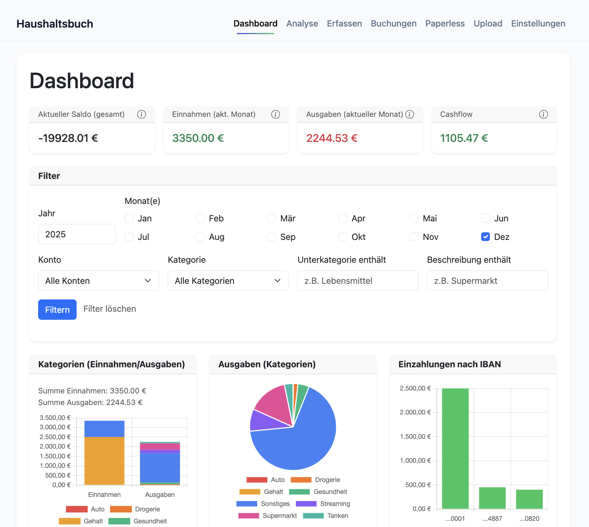
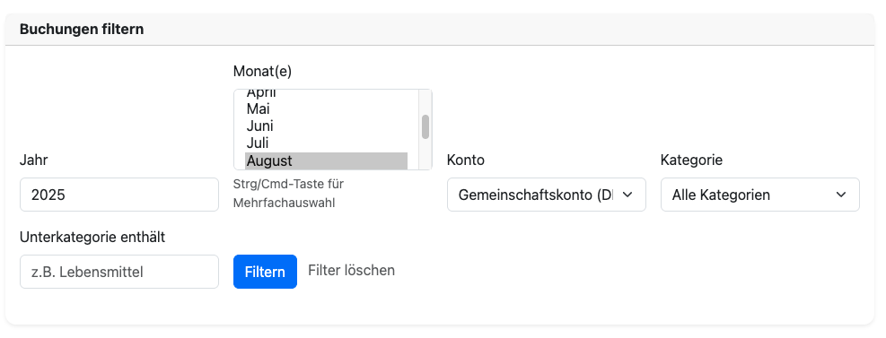
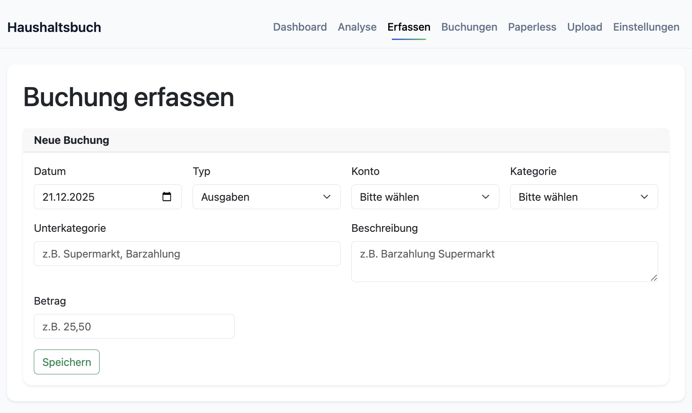
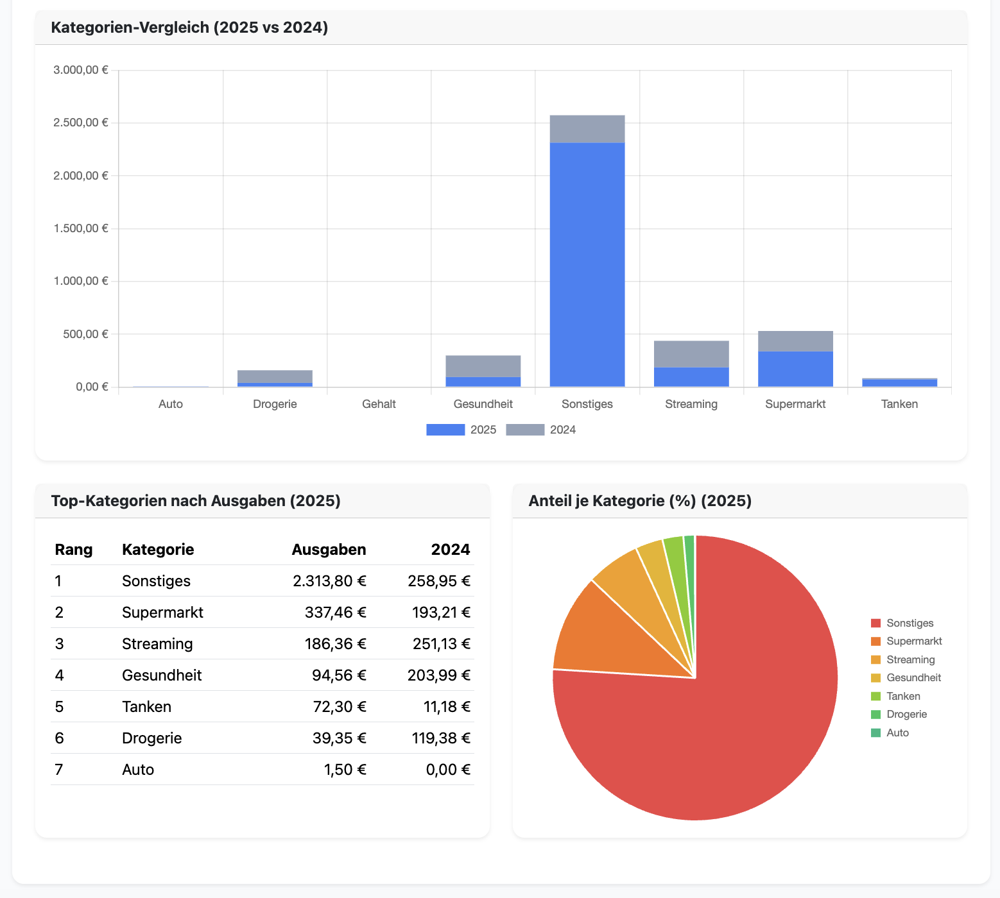
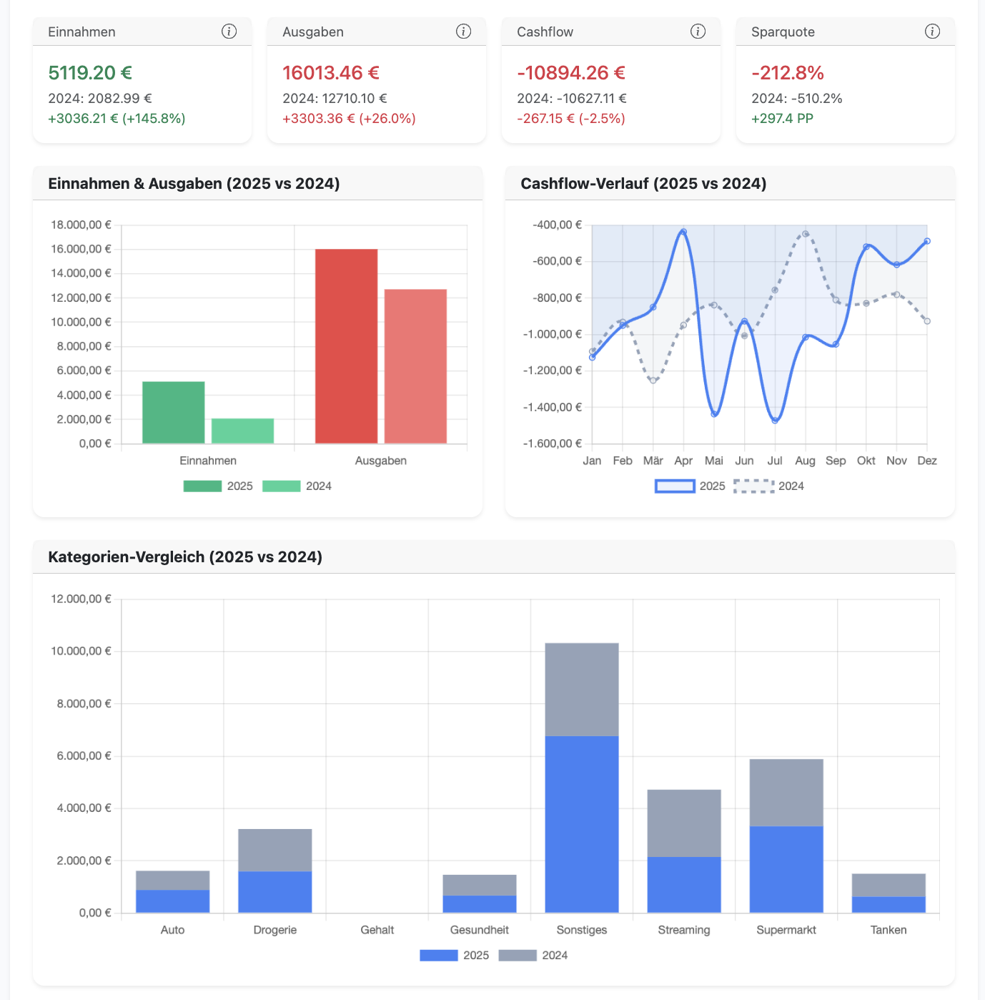
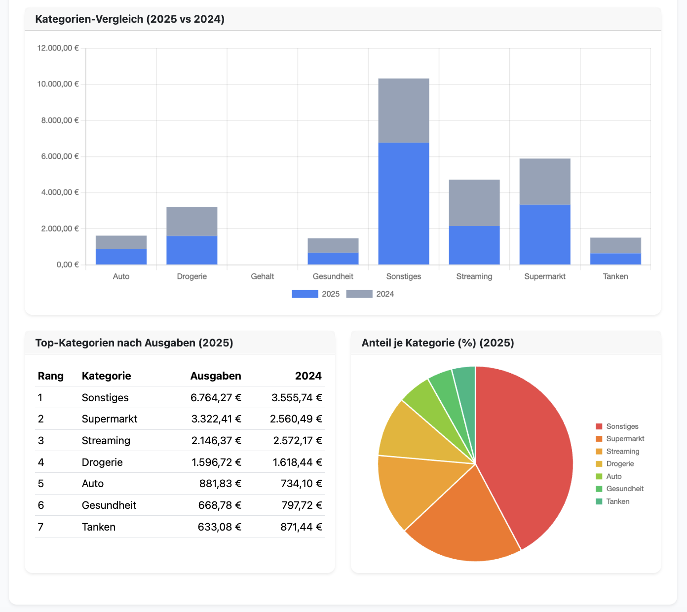
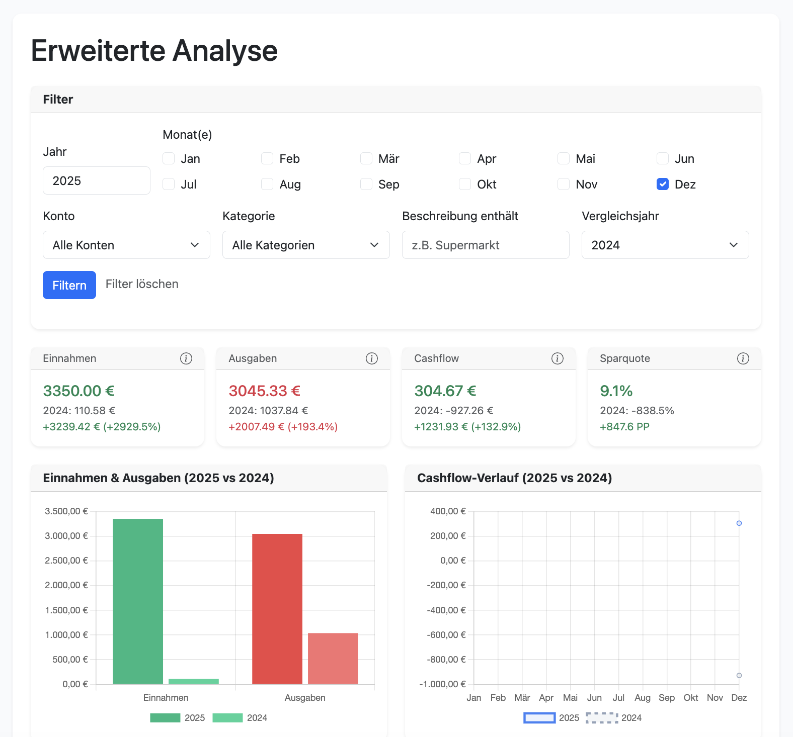
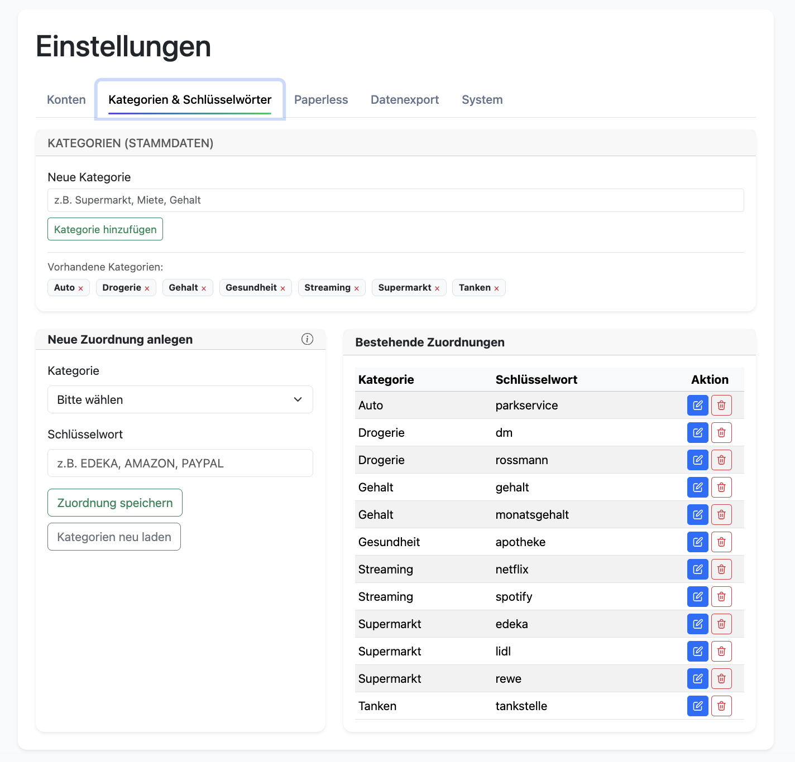

# Haushaltsbuch – CSV zu Dashboard

## Übersicht

Mit dieser Anwendung können Sie Ihre Finanzen einfach und übersichtlich verwalten. Laden Sie Ihre Bankumsätze als CSV-Dateien hoch, und die Anwendung organisiert alles automatisch für Sie.

**Was die Anwendung für Sie tut:**

- Manuelles Erfassen von Buchungen (z. B. Barzahlungen)
- Automatisierten CSV-Import (z. B. aus Online-Banking-Exporten)
- **Übersichtliches Dashboard**: Sehen Sie auf einen Blick Ihre Einnahmen, Ausgaben und den aktuellen Saldo
- **Detaillierte Analysen**: Verschiedene Diagramme zeigen Ihnen, wofür Sie Ihr Geld ausgeben und wo Sie sparen können
- **Flexible Filterung**: Filtern Sie nach Zeitraum, Konto, Kategorie oder suchen Sie nach bestimmten Beschreibungen
- **Manuelle Buchungen**: Erfassen Sie auch Barzahlungen oder andere Buchungen, die nicht über die Bank laufen
- **Kontenverwaltung**: Verwalten Sie mehrere Konten (Girokonto, Sparkonto, etc.) in einer Übersicht
- **Dokumentenverwaltung**: Integrieren Sie Paperless-ngx, um Belege automatisch zu archivieren

---

## Funktionen im Detail

### Dashboard – Ihre Finanzübersicht

Das Dashboard ist Ihr zentraler Einstiegspunkt. Hier sehen Sie:

- **Übersichtskarten**: Aktueller Saldo, Einnahmen und Ausgaben des Monats, sowie Ihr Cashflow auf einen Blick
- **Interaktive Diagramme**: 
  - Balkendiagramme zeigen Ihre Einnahmen und Ausgaben nach Kategorien
  - Tortendiagramme visualisieren, wofür Sie am meisten Geld ausgeben
  - Einzahlungen werden nach Konten aufgeschlüsselt
- **Buchungsübersicht**: Alle Ihre Buchungen in einer übersichtlichen Tabelle
- **Flexible Filterung**: Filtern Sie nach Jahr, Monat, Konto, Kategorie oder suchen Sie nach bestimmten Begriffen in der Beschreibung
- **Export-Funktion**: Laden Sie Ihre gefilterten Buchungen als CSV-Datei herunter, z. B. für Excel oder andere Programme


*Dashboard mit Übersichtskarten, Diagrammen und Buchungstabelle*


*Buchungen-Übersicht mit Filterung und Paginierung*

### Buchungen manuell erfassen

Nicht alle Ausgaben laufen über die Bank. Erfassen Sie Barzahlungen, Spenden oder andere Buchungen einfach manuell:

- **Datum**: Wann fand die Buchung statt?
- **Typ**: Handelt es sich um eine Ausgabe oder Einnahme?
- **Konto**: Wählen Sie das betroffene Konto aus Ihrer Kontenliste
- **Kategorie**: Wählen Sie die passende Kategorie (z. B. "Lebensmittel", "Tanken", "Gehalt")
- **Unterkategorie**: Optional können Sie eine Unterkategorie angeben (z. B. "Bio-Lebensmittel")
- **Betrag**: Geben Sie den Betrag ein (Komma oder Punkt als Dezimaltrenner funktioniert)
- **Beschreibung**: Beschreiben Sie kurz, worum es sich handelt

Manuell erfasste Buchungen werden automatisch markiert, damit sie bei späteren CSV-Imports nicht überschrieben werden.


*Formular zum manuellen Erfassen von Buchungen*

### Buchungen bearbeiten oder löschen

Haben Sie einen Fehler gemacht oder möchten Sie eine Buchung korrigieren? Kein Problem:

- **Bearbeiten**: Klicken Sie auf das Bearbeiten-Symbol bei einer Buchung. Sie können alle Angaben ändern:
  - Datum, Betrag, Beschreibung
  - Kategorie und Unterkategorie
  - Ob es sich um eine Ausgabe oder Einnahme handelt
  - **Schutz vor Überschreibung**: Aktivieren Sie die Option "Manuell bearbeitet", damit die Buchung bei späteren CSV-Imports nicht automatisch neu kategorisiert wird
- **Löschen**: Möchten Sie eine Buchung entfernen? Klicken Sie auf das Löschen-Symbol. Zur Sicherheit werden Sie noch einmal gefragt, bevor die Buchung endgültig gelöscht wird.

### Erweiterte Analyse

Die Analyse-Seite bietet umfangreiche Visualisierungen und Statistiken:

- **Kategorien-Analysen**: Detaillierte Aufschlüsselung nach Kategorien
- **Top-Kategorien nach Ausgaben**: Übersicht der größten Ausgabenposten
- **Anteil je Kategorie (%)**: Prozentuale Verteilung der Ausgaben
- **Vergleichsansichten**: Möglichkeit, verschiedene Zeiträume zu vergleichen


*Analyse-Übersicht mit verschiedenen Diagrammen und Statistiken*


*Detaillierte Kategorien-Analyse und Ausgabenverteilung*


*Top-Kategorien und Anteil je Kategorie*


*Vergleichsansicht mit verschiedenen Zeiträumen*

### Einstellungen – Alles im Griff

In den Einstellungen verwalten Sie alle wichtigen Konfigurationen:

- **CSV Upload & Import**
  - CSV-Datei hochladen (`/upload_csv`): Datei wird in den Ordner `import/` gespeichert.
  - Buttons:
    - „Kategorien neu laden“ → ruft `reload_category.py` auf.
    - „CSV Daten einlesen“ → ruft `import_data.py` auf.

**Kontenverwaltung**
- Legen Sie alle Ihre Konten an (Girokonto, Sparkonto, etc.)
- Für jedes Konto können Sie Name, IBAN und eine Beschreibung hinterlegen
- Konten können jederzeit bearbeitet oder gelöscht werden

**Kategorien & Zuordnungen**
- Erstellen Sie Ihre eigenen Kategorien (z. B. "Lebensmittel", "Freizeit", "Auto")
- Legen Sie fest, welche Schlüsselwörter welcher Kategorie zugeordnet werden sollen
  - Beispiel: Wenn "REWE" in der Beschreibung steht → Kategorie "Supermarkt"
  - So werden Ihre Buchungen automatisch richtig kategorisiert

**Paperless-Integration** (optional)
- Wenn Sie Paperless-ngx für die Dokumentenverwaltung nutzen, können Sie hier die Verbindung konfigurieren
- Belege, die Sie fotografieren, werden automatisch an Paperless gesendet

**System-Informationen**
- Sehen Sie die aktuelle Version der Anwendung
- Prüfen Sie, ob ein Update verfügbar ist


*Einstellungen mit verschiedenen Tabs: Konten, Kategorien, Paperless, System*

---

## Technische Anforderungen

- **Betriebssystem**: Debian/Ubuntu mit systemd (getestet auf Debian 12)
- **Python**: 3.11
- **Datenbank**: MySQL oder MariaDB (z. B. MariaDB 10.x)
- **Pakete (in venv)**:
  - `flask`
  - `mysql-connector-python`
  - `pandas`
  - `python-dateutil`
  - `requests` (für Paperless-API)
- **Systempakete**:
  - `python3`, `python3-venv`, `python3-pip`
  - `mariadb-client`
  - `git`, `curl`, `ca-certificates`

---

## Installation mit Docker

Die einfachste Methode, die Anwendung zu installieren, ist die Verwendung von Docker und Docker Compose.

### Voraussetzungen

- Docker (Version 20.10 oder höher)
- Docker Compose (Version 1.29 oder höher)

### Option 1: Interne Datenbank (MySQL im Container)

1. **Docker Compose Dateien herunterladen:**
   ```bash
   curl -O https://raw.githubusercontent.com/Sleepwalker86/Haushaltsbuch/main/docker-compose.yml
   curl -O https://raw.githubusercontent.com/Sleepwalker86/Haushaltsbuch/main/.env.example
   ```

2. **Umgebungsvariablen konfigurieren:**
   ```bash
   cp .env.example .env
   nano .env
   ```
   
   Wichtige Einstellungen:
   - `MYSQL_ROOT_PASSWORD`: Root-Passwort für MySQL
   - `MYSQL_DATABASE`: Name der Datenbank (Standard: Haushaltsbuch)
   - `MYSQL_USER`: Datenbankbenutzer
   - `MYSQL_PASSWORD`: Passwort für den Datenbankbenutzer
   - `SECRET_KEY`: Sicherer Secret Key für Flask (wichtig!)

3. **Container starten:**
   
   Die Docker Compose Dateien sind bereits so konfiguriert, dass sie das fertige Image von Docker Hub verwenden (`sleepwalker86/finanzapp:latest`).
   
   **Hinweis:** Falls Sie das Image lokal bauen möchten (z.B. für Entwicklung), können Sie in der `docker-compose.yml` die Zeile `image: sleepwalker86/finanzapp:latest` auskommentieren und stattdessen `build:` aktivieren.

4. **Logs prüfen:**
   ```bash
   docker compose logs -f app
   ```

6. **Anwendung aufrufen:**
   Öffnen Sie im Browser: `http://localhost:5001` oder `http://host-ip:5001`

### Option 2: Externe Datenbank

1. **Docker Compose Dateien herunterladen:**
   ```bash
   curl -O https://raw.githubusercontent.com/Sleepwalker86/Haushaltsbuch/main/docker-compose.external-db.yml
   curl -O https://raw.githubusercontent.com/Sleepwalker86/Haushaltsbuch/main/.env.example
   ```

2. **Umgebungsvariablen konfigurieren:**
   ```bash
   cp .env.example .env
   nano .env
   ```
   
   Wichtige Einstellungen:
   - `DB_HOST`: IP-Adresse oder Hostname der externen Datenbank
   - `DB_USER`: Datenbankbenutzer
   - `DB_PASSWORD`: Passwort für den Datenbankbenutzer
   - `DB_NAME`: Name der Datenbank
   - `SECRET_KEY`: Sicherer Secret Key für Flask (wichtig!)

3. **Container starten:**
   
   Die Docker Compose Dateien sind bereits so konfiguriert, dass sie das fertige Image von Docker Hub verwenden (`sleepwalker86/finanzapp:latest`).
   
   **Hinweis:** Falls Sie das Image lokal bauen möchten (z.B. für Entwicklung), können Sie in der `docker-compose.external-db.yml` die Zeile `image: sleepwalker86/finanzapp:latest` auskommentieren und stattdessen `build:` aktivieren.

4. **Logs prüfen:**
   ```bash
   docker compose -f docker-compose.external-db.yml logs -f app
   ```

6. **Anwendung aufrufen:**
   Öffnen Sie im Browser: `http://localhost:5001` oder `http://host-ip:5001`

### Wichtige Hinweise

- **Externe Datenbank:** Stellen Sie sicher, dass die Datenbank Remote-Verbindungen erlaubt (MySQL `bind-address = 0.0.0.0`)
- **Firewall:** Port 3306 muss vom Container aus erreichbar sein
- **Benutzerrechte:** Der Datenbankbenutzer muss die entsprechenden Rechte haben (CREATE, INSERT, UPDATE, DELETE, SELECT)
- **Nach .env Änderungen:** Container neu starten mit `docker compose restart app`

### Weitere Informationen

Für detaillierte Docker-Dokumentation siehe [DOCKER.md](https://github.com/Sleepwalker86/Haushaltsbuch/blob/main/DOCKER.md) im Repository.

---

## Installation (Server)

### 1. Repository nach `/opt` klonen

```bash
sudo git clone https://github.com/Sleepwalker86/Haushaltsbuch.git /opt/finanzapp
cd /opt/finanzapp
```

### 2. Installationsscript ausführen

```bash
sudo chmod +x install.sh
sudo ./install.sh
```

Das Script erledigt:

1. `apt update` und Installation der Systempakete.
2. Anlage des Users `finanzapp` (falls nicht vorhanden).
3. Klonen/Update des Repos unter `/opt/finanzapp` (als User `finanzapp`).
4. Anlage des Ordners `import/`.
5. Erzeugung einer Python-virtualenv unter `/opt/finanzapp/venv`.
6. Installation der Python-Abhängigkeiten in der venv.
7. Anlegen von `config.json` (falls nicht vorhanden) mit interaktiver Abfrage von:
   - DB-Host
   - DB-User
   - DB-Passwort
   - DB-Name
8. Anlegen und Aktivieren der systemd-Units:
   - `finanzapp.service` – startet die Flask-App (Produktionsmodus, kein Debug).
   - `finanzapp-import.service` – einmaliger CSV-Import via `import_data.py`.
   - `finanzapp-import.timer` – ruft den Import-Service alle 10 Minuten auf.

### 3. Services prüfen

```bash
systemctl status finanzapp.service
systemctl status finanzapp-import.timer
```

Die App ist i. d. R. unter `http://SERVER-IP:5001` erreichbar.

---

## Deinstallation (Server)

Um die Anwendung inklusive systemd-Services sauber zu entfernen, gibt es ein eigenes Script `uninstall.sh`.

```bash
cd /opt/finanzapp
sudo chmod +x uninstall.sh
sudo ./uninstall.sh
```

Das Script erledigt:

1. Stoppen und Deaktivieren von:
   - `finanzapp.service`
   - `finanzapp-import.service`
   - `finanzapp-import.timer`
2. Entfernen der systemd-Unit-Dateien unter `/etc/systemd/system/`.
3. `systemctl daemon-reload` und `systemctl reset-failed`.
4. Löschen des App-Verzeichnisses `/opt/finanzapp`.
5. Optionales Löschen des Benutzers `finanzapp` (nach Rückfrage).

Die MySQL-Datenbank und ihre Inhalte werden **nicht** gelöscht, damit deine Buchungsdaten erhalten bleiben.

---

## Lokale Entwicklung

### 1. Klonen & venv

```bash
git clone https://github.com/Sleepwalker86/Haushaltsbuch.git
cd Haushaltsbuch

python3 -m venv .venv
source .venv/bin/activate
pip install --upgrade pip
pip install -r requirements.txt
```

### 2. `config.json` anlegen (lokal)

```json
{
  "DB_CONFIG": {
    "host": "127.0.0.1",
    "user": "dein_user",
    "password": "dein_passwort",
    "database": "Haushaltsbuch"
  }
}
```

### 3. App lokal starten

```bash
export FLASK_DEBUG=1
python app.py
```

Dann ist die App unter `http://127.0.0.1:5001` erreichbar.

---

## Paperless-Integration

### Funktionen

1. **Dokumente fotografieren** (`/paperless`):
   - Direkter Zugriff auf die iPhone/iPad-Kamera über die Web-Oberfläche.
   - Unterstützte Formate: JPG, PNG, HEIC, HEIF, PDF.
   - Bilder werden im Ordner `image/` gespeichert.

2. **Automatischer Upload**:
   - Das Skript `import_data.py` prüft bei jedem Lauf (alle 10 Minuten via Timer) den `image/`-Ordner.
   - Neue Bilder werden automatisch an die konfigurierte Paperless-Instanz gesendet.
   - Bei erfolgreichem Upload werden die Bilder gelöscht.
   - Bei Fehlern bleiben die Bilder erhalten für manuelle Nachbearbeitung.

3. **Konfiguration**:
   - In den Einstellungen (Tab "Paperless") können konfiguriert werden:
     - Paperless-URL/IP-Adresse (z. B. `http://192.168.1.100:8000`)
     - API-Token (aus den Paperless-Einstellungen)
     - Dokumententyp-ID (optional, für automatische Kategorisierung)

### Voraussetzungen

- Paperless-ngx oder Paperless-ng Instanz muss erreichbar sein.
- API-Token muss in Paperless generiert werden (Einstellungen → API-Token).
- Die Konfiguration wird in `config.json` unter `PAPERLESS` gespeichert.

---

## Nutzung

1. **Einstellungen → Konten**: Konten anlegen (Name, IBAN, Beschreibung).
2. **CSV Upload**:
   - Im Tab „Upload“ CSV hochladen (landet im `import/`-Ordner).
   - „CSV Daten einlesen“ ausführen oder Timer abwarten.
3. **Dashboard** ansehen und filtern:
   - Jahr, Monat, Konto, Kategorie, Unterkategorie.
   - Gefilterte Buchungen als CSV exportieren.
4. **Buchungen manuell erfassen** unter `/`.
5. **Buchungen bearbeiten oder löschen** über die Tabelle im Dashboard.
   - `manually_edit`-Status per Toggle ein-/ausschalten.
6. **Paperless-Integration**:
   - Dokumente fotografieren unter `/paperless`.
   - Automatischer Upload erfolgt beim nächsten CSV-Import (alle 10 Minuten).

---

## Lizenz / Nutzung

© 2025 Sascha Moritz

Der Quellcode darf für den **eigenen Gebrauch** angepasst und erweitert werden.

Eine **Weitergabe, Veröffentlichung oder kommerzielle Nutzung veränderter Versionen ist nicht gestattet**.

Wenn du den Code in einem anderen Kontext einsetzen willst (z. B. in einem Unternehmen oder als Open‑Source‑Projekt), kläre dies bitte vorher mit dem Autor.

---

## Haftungsausschluss

Dieses Projekt wird ohne Garantie bereitgestellt. Es gibt keine Gewähr für Richtigkeit, Vollständigkeit oder Eignung für einen bestimmten Zweck. Die Nutzung erfolgt auf eigene Verantwortung – insbesondere im Hinblick auf den Umgang mit sensiblen Finanzdaten.
